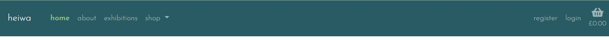
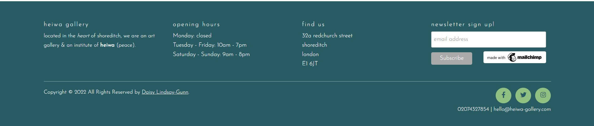
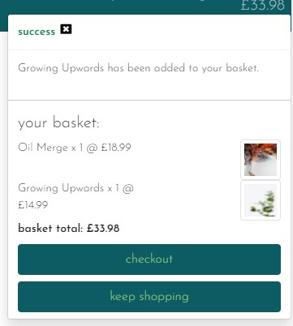
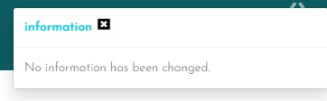
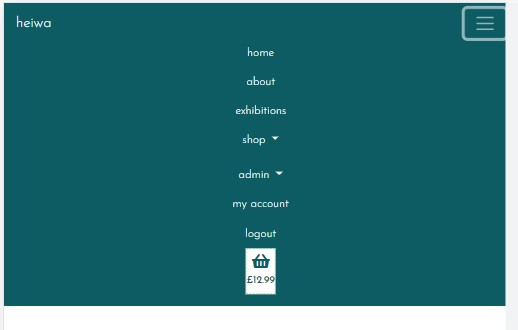
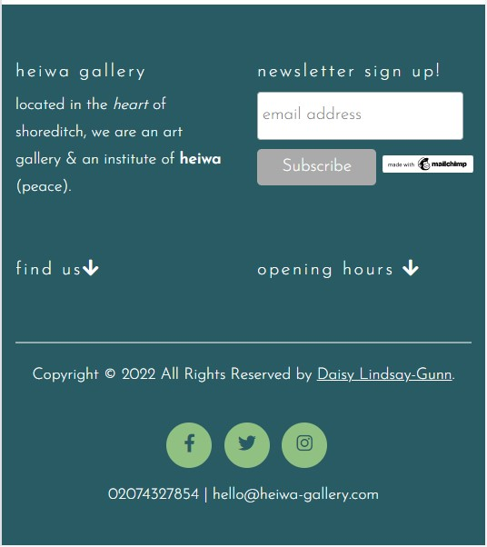

# Manual Testing

[Back to main README](README.md)

### **Epic 1 - Core Functionality**:

1. As a **user** I can intuitively navigate through the site so that I can view desired content.
2. As a **user** I can find a navigation bar and footer so that I can see what content there is on the website.

3. As a **user** I can get key information about the gallery from the landing page so that I can spend less time having to search for information.

- The navigation bar remains at the top constantly so it can always be seen by the user. Each page is clearly named and there are dropdowns for subsections of the website so that there isn't too much information in the navbar.

- The footer is at the bottom of the page but isn't fixed and contains key information about the gallery. Contact details, opening times, social media links & address are items that will be frequently searched for by a user, so placing them in the footer makes it easier to find.

4. As a **user** I am notified about any changes I have made so that I have a clear understanding of what has been completed/updated/failed.

- I have used bootstrap toasts to display messages to the user at various points, the success toast is used often and when adding a prodcut to the basket also displays a short basket overview

- I have also used info, warning and error toasts to display different messages:

5. As a **user** I can access the website on both mobile and desktop so that I can view the information regardless of my location.

- 

### **Epic 2 - Products**:

5. As a **user** I can view all products that are in stock and available to buy.
6. As a **user** I can easily find all of the relevant information about the products so that I can make informed decisions before purchasing.
7. As a **user** I can filter the prints by categories to have more control over what I'm viewing.
8. As a **user** I can easily identify prints that are not in stock so that I can avoid later frustration if they are not available.

### **Epic 3 - Orders/Basket**:

9. As a **user** I am able to process orders by making a card payment.
10. As a **user** I can view a breakdown of their current basket so that I can make changes if required.
11. As a **user** I can only add prints to my basket that are in stock so that I can avoid later frustration if my order cannot be fulfilled.
12. As a **user** I receive order confirmations to be sure my order has been processed.

### **Epic 4 - Admin Functionality**:

13. As an **admin user** I can log in so that I can access the site's backend.
14. As an **admin user** I am able to login to see the product management page so that I can make changes in the front end.
15. As an **admin user** I can add/edit/remove items from the product model so that I can make sure the website is up to date and accurately reflects what is being sold.
16. As an **admin user** I can update the stock levels for the products so that customers are only able to purchase items in stock.

### **Epic 5 - User Account**:

17. As a **user** I can register & log in so that I can view my orders.
18. As a **user** I can easily see if I'm logged in or not so that I can choose to log in or log out.
19. As a **user** I am prompted to register for an account so that I can create an account and receive the benefits from having a profile.
20. As a **user** I can log in so that I can auto-populate forms with my information on the site.
21. As a **user** I can save my default billing/shipping details so that I can save time making my next purchase.

### **Epic 6 - Exhibition Information**:

23. As an **admin user** I can add/edit/delete exhibition to be displayed on the website.
24. As a **user** I can find the date, description and entry fee for each exhibition so that I can make informed decisions about attending.

### **Epic 7 - Marketing**:

25. As a **user** I can sign up to a newsletter to up to date information regarding exhibitions and items for sale.
26. As an **admin user** I conducted research and implemented SEO keywords to increase traction to my website.
27. As an **admin user** I have created a FB shop page to increase traction to my website.
