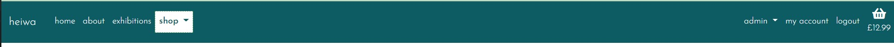
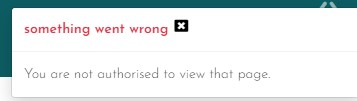
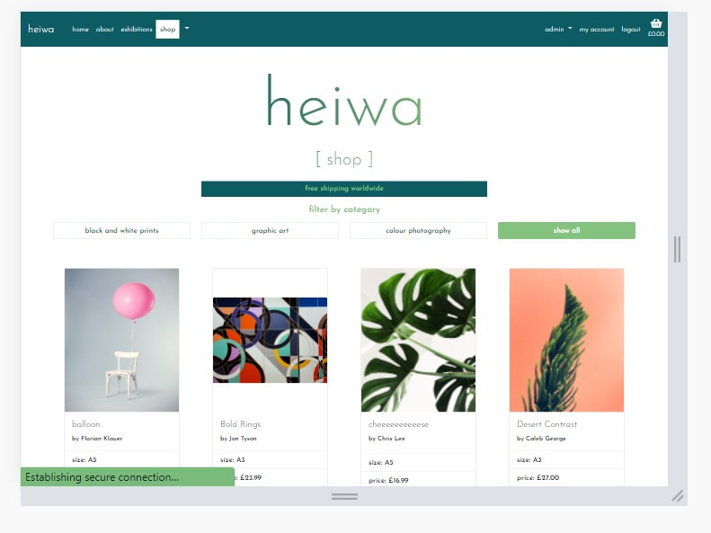
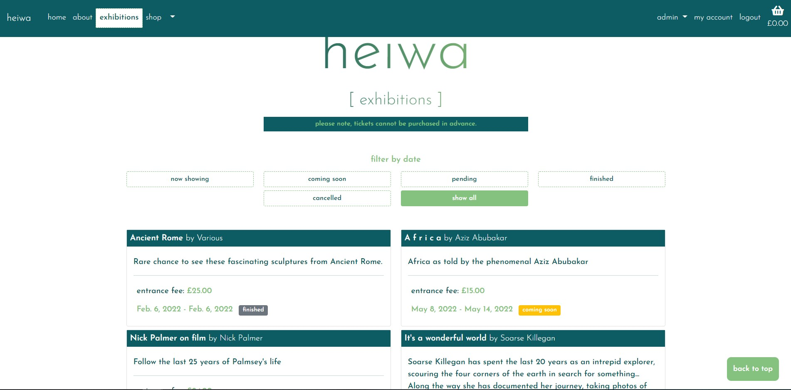
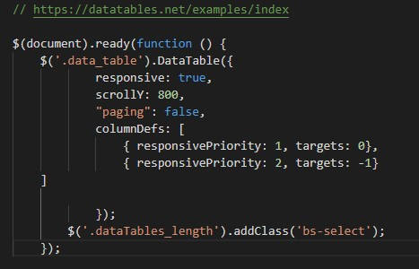
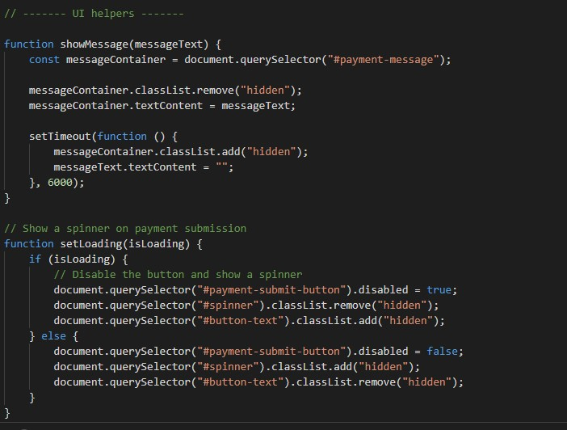

# Manual Testing

[Back to main README](README.md)

### **Epic 1 - Core Functionality**:

1. As a **user** I can intuitively navigate through the site so that I can view desired content.
2. As a **user** I can find a navigation bar and footer so that I can see what content there is on the website.
3. As a **user** I can get key information about the gallery from the landing page so that I can spend less time having to search for information.

- The navigation bar is fixed at the top of the screen, meaning it is always seen by the user, allowing the user to navigate through the content easily & intuitively. Each nav link is named with an obvious link to the page content, for the shop and admin links there are dropdowns for subsections of the website so that there isn't too much information in the navbar.

- I have added a back to top button that appears when the user scrolls down any of the pages, enabling them to quickly navigate back to the top without having to scroll:

- The footer is at the bottom of the page but isn't fixed and contains key information about the gallery. Contact details, opening times, social media links & the gallery address are all items that will be frequently searched for by a user, so placing them in the footer makes them easier to find thus ensuring that the user can obtain key information quickly.

4. As a **user** I am notified about any changes I have made so that I have a clear understanding of what has been completed/updated/failed.

- I have used bootstrap toasts to display messages to the user at various points throughout their customer journey. The success toast is used often and when adding a product to the basket also displays a short basket overview:

- I have also used info, warning and error toasts to display various other messages; this ensures the user has awareness of any changes that have been made or have been unsuccessful:

5. As a **user** I can access the website on both mobile and desktop so that I can view the information regardless of my location.

- As I have used bootstrap the website is entirely responsive and can be viewed on any size screen and have the same functionality; however, some non-critical content has been hidden on smaller screens to enhance the user experience.

- I have also taken advantage of JQuery data tables which will collapse a table, with a specified class name, on smaller screens so the user doesn't have to scroll across. I have implemented this on both the product and exhibition management pages and also on the basket overview.

-  The user is then able to click on the green icon to expand the table row to show all of the information & I have added a clear message at the top of the screen so the user isn't confused:

### **Epic 2 - Products**:

5. As a **user** I can view all products that are in stock and available to buy

- Using the `shop` nav link the user is directed to the `all_products` page, this is a view that returns all products in the product model.

6. As a **user** I can easily find all of the relevant information about the products so that I can make informed decisions before purchasing.

- Each product card displays a title, who it is by, size, price and category giving the user all information they could want before deciding to buy

7. As a **user** I can filter the prints by categories to have more control over what I'm viewing.

- At the top of the products page are four buttons that allow the user to filter by category and a 'products in stock' button that only shows the products that are available to buy:

- Clicking on one of these buttons sends a query to the database and returns the relevant products using the style id or the 'in_stock' field:

8. As a **user** I can easily identify prints that are not in stock so that I can avoid later frustration if they are not available.

- Products have a clear `'sorry, not in stock'` label and the add to basket button is hidden so that it is extremely clear for the user this product cannot currently be purchased.

### **Epic 3 - Orders/Basket**:

9. As a **user** I am able to process orders by making a card payment.

- Using Stripe, each time the checkout page is loaded a payment intent is created and a card element is injected into the page. Using the test card details from the Stripe documentation you can test the checkout process, if successful a `'Payment success!'` message is displayed above the pay now button and the user is redirected to the checkout success page.

10. As a **user** I can view a breakdown of their current basket so that I can make changes if required.

- The basket page displays all of the information regarding the users current basket, product name & image, subtotal and quantity.

- The plus or minus buttons will change the quantity in the select box and then pressing update pushes those changes to the user's current basket.

11. As a **user** I can only add prints to my basket that are in stock so that I can avoid later frustration if my order cannot be fulfilled.

- As the `add to basket` button is removed the user is not easily able to add any product to the basket. However, if they were to try and overwrite the URL by changing the product pk passed, then I have used defensive programming so that if the required data is not passed through the post request the user is shown an error message and they are redirected back to the all_products page.

12. As a **user** I receive order confirmations to be sure my order has been processed.

- Upon submitting the payment form, if successful and the user is redirected to checkout success then the `send_confirmation_email` function is called, which uses the email address from the order form, this function sends an email that has the order total, shipping details, order number and products purchased in:

### **Epic 4 - Admin Functionality**:

13. As an **admin user** I can log in so that I can access the site's backend.

- Using a specified superuser account an admin user can access the `/admin` URL and login, they will then be taken to the 'Django Administration' page:

14. As an **admin user** I am able to log in to see the product management page so that I can make changes in the front end.

- Once logged in as an admin superuser the navbar displays `admin`, clicking this shows the below menu:

- From here, if the user clicks `product management` they are taken to the product management page. This page displays all of the products in the product model, using a datatable so that the admin user can sort & search.

15. As an **admin user** I can add/edit/remove items from the product model so that I can make sure the website is up to date and accurately reflects what is being sold.

16. As an **admin user** I can update the stock levels for the products so that customers are only able to purchase items in stock.

- In the final column of the product management table there are buttons to `edit`, `update stock` or `delete`, clicking these allow the user to complete those tasks. 

- The `edit` button takes the user to a specified edit page, there is a form pre-populated using the product instance and the user can update the information and submit the form. The quantity in stock field is hidden on this form to ensure the user can only edit the stock level using the stock form. 

- The `delete` button takes the user to a specified delete page for the product, this page displays the product image, name and a delete button.

- If the user clicks `delete product` then a modal pops up to ensure that the user definitely wants to delete the product and has not pressed this by mistake

- If the user clicks `yes, delete` then the product is deleted from the model, the user is taken back to the product management page and a toast confirming the deletion appears.

### **Epic 5 - User Account**:

17. As a **user** I can register & login so that I can view my orders/wishlist.

- Once a user is logged in, using the `my account` link in the navbar will bring the user to their account overview page. From here they can access either their personal details, previous orders or wishlist.

18. As a **user** I can easily see if I'm logged in or not so that I can choose to log in or log out.

- The navbar links on the right-hand side change depending on the authentication state of the user, if logged in then `my account` & `logout` show:

- and if the user is not authenticated then `register` and `login` are displayed. This differentiation makes it very clear and obvious to the user if they are currently logged in:

19. As a **user** I am prompted to register for an account so that I can create an account and receive the benefits of having a profile.

- The register link in the navbar is the first prompt, if the user clicks to log in this page will prompt them to register for an account if they don't already have one:

- On the checkout page, if the user isn't logged in there is a paragraph that prompts the user to register or log in to save their details for next time:

20. As a **user** I can log in so that I can auto-populate forms with my information on the site.
21. As a **user** I can save my default billing/shipping details so that I can save time making my next purchase.

- When a user first creates an account and logs in none of their information will be saved to their profile yet, but after completing the user profile form or making their first order (with the save details box ticked) then both the user profile form and the order form will be pre-filled with their details:

### **Epic 6 - Exhibition Information**:

23. As an **admin user** I can add/edit/delete exhibitions to be displayed on the website.

- The exhibitions functionality works in the same way as products, there are `add exhibition` and `exhibition management` in the admin dropdown menu. `add exhibition` takes the admin user to the add exhibition page, which is comprised of a form:

- `exhibition management` takes the user to a page comprised of a data table that holds all of the exhibition information in the model:

 

- from here the admin user can edit an exhibition:

- Or delete the chosen exhibition:

- If the user clicks `delete` then a modal pops up to ensure the user is making the right decision: 

- Once deleted a toast confirms that it has been successful:

 
24. As a **user** I can find the date, description and entry fee for each exhibition so that I can make informed decisions about attending.

- The exhibitions are displayed as cards in columns, each card has the date, description and entry fee in it to provide the user with all the necessary information:

### **Epic 7 - Marketing**:

25. As a **user** I can sign up for a newsletter to receive up to date information regarding exhibitions and items for sale.

- In the footer there is a MailChimp sign up form to allow the user to sign up:

- If the user is already present in the subscribed list then the form is hidden and a thank you message is displayed instead:

- I have also added a link in the 4th slide on the main carousel to link to this section of the website & also from the about page.

26. As an **admin user** I conducted research and implemented SEO keywords to increase traction to my website.

- During the planning stage, SEO research was conducted to decide which keywords would help with SEOs:

- These keywords were then added across the website content and added in the meta tags & descriptions:

27. As an **admin user** I have created a FB shop page to increase traction to my website.

- Facebook page for Heiwa can be found here:

---
## Javascript testing

I have written a number of javascript functions in order to acheive the desired functionality across the website. For functions required across the website, these are featured the base.js file, specific page-related functions are within the app js folder.

### Base.js 

`**screenClass()**` & **Footer toggle**

This function determines the size of the screen and trigger various changes if the screen is smaller than 760px.

Some of the footer elements collapse and a down arrow icon appears:

This set of functions, `showHours` and `showLocation`, then allow the user to click on the down arrow to show the relevant section, you can see that the hidden class is added when the information isn't shown:

and then removed in order to show it:

The `dropdown-toggle` functions ensure that the navbar works correctly on a mobile, on a laptop you are able to hover on the dropdown menus to display the links nested within this menu. However, this does not work on mobiles and so I have added `click` events, so that when the icon is clicked the menu shows using the `show` class:

You can also see in the image above that there is no `href` for the shop item as I didn't want the user to be frustrated when trying to expand the shop menu if they were navigated to the shop page rather than being able to click on one of the dropdown menu links. The href is removed on smaller screens and then added back in again on larger screens:

**Mailchimp message**

This `setInterval` function hide the MailChimp message (either success or failure) after 30 seconds:

When testing this there have been a handful of occasions where the subscribe message flashes rather than waiting the full 30 seconds but I haven't been able to determine exactly what causes this as there is no consistency with it.

### Datatable.js

This function simply creates a datatable when the class `data_table` is added to a table, this is used on the products management, exhibition management and basket overview page. 

### Exhibitions

**`datePicker()`**

This function uses jQuery to make the date fields in the exhibition form datepickers:

### Basket

`decrease` & `increase` functions are used to change the value of the quantity button for each product.

I have added a data-id to each of the product increase/decrease buttons, so that when the button is clicked the correct quantity field is update. For testing purposes I added print statements within the functions to show that the correct product was having it's quantity changed:

There is an alert in the decrease function that is called if the user tries to reduce the quantity below zero:

And one in the increase function that is called if the user tries to increase the quanity higher than 5, as it is the shops policy that only 5 of a single product can be bought at any one time:

### Checkout

**save-address**

This function simply changes the 'checked' state of the save details box on the checkout page, once clicked if the check attribute is already present then it removes it and if not present then it adds it:

**Stripe**

This function injects the card payment using the Stripe JS file import

The showMessage and setLoading functions are from the stripe docs, and simply show the messages associated with the card payment and add a spinner on the pay now button once it has been clicked:

This function submits the payment form, posting the data to Stripe via the `cache_checkout_data` view and returns a success message if the payment was successful:

You can see via the messages in the terminal that the cache_checkout_data view was called and got a 200 response, which is a success, POST checkout got a 302 response as it then redirected to `checkout success` and the confirmation email was sent.

If there is an error with the payment then a error message is displayed and the form isn't submitted:

[Back to main README](README.md)