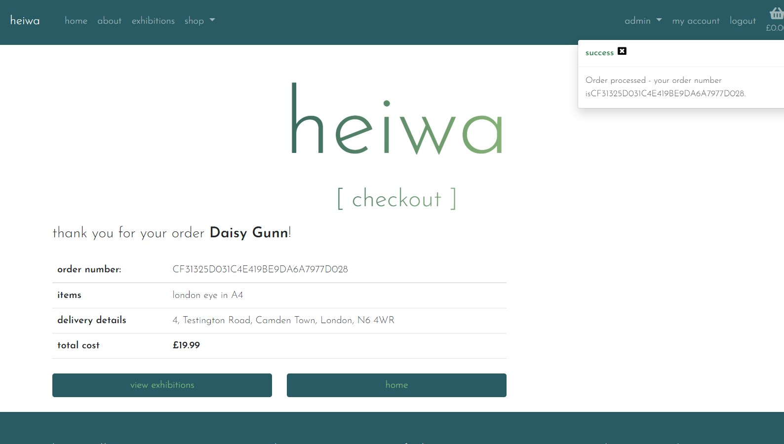
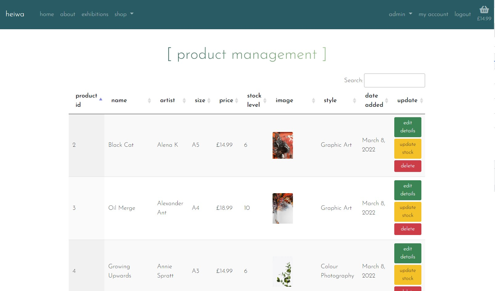
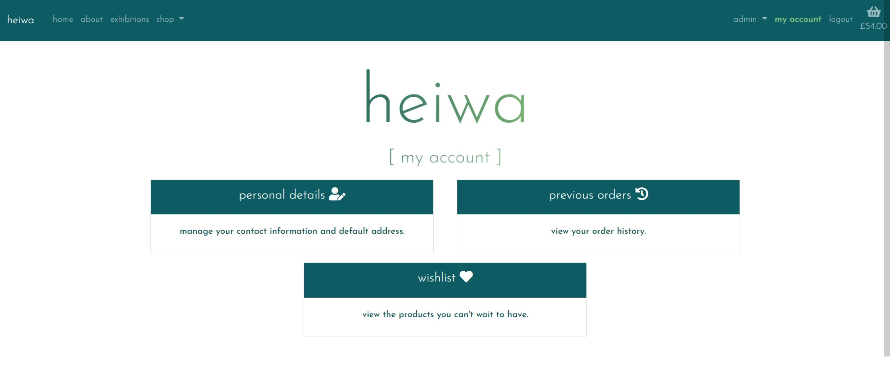
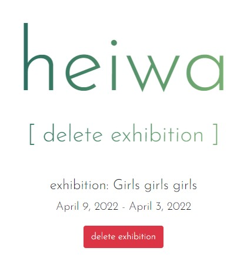

# Manual Testing

[Back to main README](README.md)

### **Epic 1 - Core Functionality**:

1. As a **user** I can intuitively navigate through the site so that I can view desired content.
2. As a **user** I can find a navigation bar and footer so that I can see what content there is on the website.

3. As a **user** I can get key information about the gallery from the landing page so that I can spend less time having to search for information.

- The navigation bar remains at the top constantly so it can always be seen by the user. Each page is clearly named and there are dropdowns for subsections of the website so that there isn't too much information in the navbar.

- The footer is at the bottom of the page but isn't fixed and contains key information about the gallery. Contact details, opening times, social media links & address are items that will be frequently searched for by a user, so placing them in the footer makes it easier to find.

4. As a **user** I am notified about any changes I have made so that I have a clear understanding of what has been completed/updated/failed.

- I have used bootstrap toasts to display messages to the user at various points, the success toast is used often and when adding a product to the basket also displays a short basket overview:

- I have also used info, warning and error toasts to display different messages:

5. As a **user** I can access the website on both mobile and desktop so that I can view the information regardless of my location.

- As I have used bootstrap the website is entirely responsive and can be viewed on any size screen and have the same functionality. 

- I have also taken advantage of JQuery datatables which collapse the tables on smaller screens so the user doesn't have to scroll across, 

- & then clicking on the green icon expands the table row to show all of the columns

### **Epic 2 - Products**:

5. As a **user** I can view all products that are in stock and available to buy.

- Using the `shop` nav link the user is directed to the `all_products` page, this is a view that returns all products in the product model.

6. As a **user** I can easily find all of the relevant information about the products so that I can make informed decisions before purchasing.

- Each product card displays a title, who it is by, size, price and style giving the user all information they could want before deciding to buy

7. As a **user** I can filter the prints by categories to have more control over what I'm viewing.

- At the top of the products page there are four buttons that will allow the user to filter by category:

- clicking on one of these buttons sends a query to the database and returns the relevant products using the style id:

8. As a **user** I can easily identify prints that are not in stock so that I can avoid later frustration if they are not available.

- Products have a clear `'sorry, not in stock'` label and the add to basket button is hidden so that it is extremely clear for the user this product cannot currently be purchased.

### **Epic 3 - Orders/Basket**:

9. As a **user** I am able to process orders by making a card payment.

- Using Stripe, each time the checkout page is loaded a payment intent is created and a card element is injected in to the page. Using the test card details from the Stripe documentation you can test the checkout process, if successful a `'Payment success!'` message is displayed above the pay now button and the user is redirected to the checkout success page.

10. As a **user** I can view a breakdown of their current basket so that I can make changes if required.

- The basket page displays all of the information regarding the users current basket, product name & image, subtotal and quantity.

- The plus or minus buttons will change the quantity in the select box and then pressing update pushes those changes to the user's current basket.

11. As a **user** I can only add prints to my basket that are in stock so that I can avoid later frustration if my order cannot be fulfilled.

- As the add to basket button is removed the user will not easily be able to add any product to the basket but if they were to try and overwrite the url by changing the product pk passed then I have used defensive programming so that if the required data is not passed through the post requets the user is shown an error message and they are redirected back to the all_products page.

12. As a **user** I receive order confirmations to be sure my order has been processed.

- Upon submitting the payment form, if successful and the user is redirect to checkout success then `send_confirmation_email` function is called which uses the email address from the order form, this function sends an email that has the order total, shipping details, order number and products purchased in:

### **Epic 4 - Admin Functionality**:

13. As an **admin user** I can log in so that I can access the site's backend.

- Using a specified superuser account an admin user can access the `/admin` url and login, they will then be taken to the 'Django Administration' page:

14. As an **admin user** I am able to login to see the product management page so that I can make changes in the front end.

- Once logged in as an admin superuser the navbar displays `admin`, clicking this shows the below menu:

- From here, if the user clicks `product management` they are taken to the product management page. This page displays all of the products in the product model, using a datatable so that the admin user can sort & search.

15. As an **admin user** I can add/edit/remove items from the product model so that I can make sure the website is up to date and accurately reflects what is being sold.

16. As an **admin user** I can update the stock levels for the products so that customers are only able to purchase items in stock.

- In the final column of the product management table there are buttons to `edit`, `update stock` or `delete`, clicking these allow the user to complete those tasks. 

- The `edit` button takes the user to a specified edit page, there is form pre-populated using the product instance and the user is able to update the information and submit the form. The quantity in stock field is hidden on this form to ensure the user can only edit the stock level using the stock form. 

- The `delete` button take the user to specified delete page for the product, this page displays the product image, name and a delete buttom.

- If the user clicks `delete product` then a modal pops up to ensure that the user definitely wants to delete the product

- If the user clicks `yes, delete` then the product is deleted from the model, the user is taken back to the product management page and a toast confirming the deletion appears.

<!-- Add image  -->

### **Epic 5 - User Account**:

17. As a **user** I can register & log in so that I can view my orders/wishlist.

- Once a user is logged in, using the `my account` link in the navbar will bring the user to their account overview page. From here they can access either their personal details, previous orders or wishlist.

18. As a **user** I can easily see if I'm logged in or not so that I can choose to log in or log out.

- The navbar links on the right hand side change depending on the authentication state of the user, if logged in then `my account` & `logout` shows:

- and if the user is not authenticated then `register` and `login` are displayed. This differentiation makes is very clear and obvious to the user if they are currently logged in:

19. As a **user** I am prompted to register for an account so that I can create an account and receive the benefits from having a profile.

- The register link in the navbar is the first prompt, if the user clicks to log in this page will prompted to register for an account if they don't already have one:

- On the checkout page, if the user isn't logged in there is a paragraph that prompts the user to register or login to save their details for next time:

20. As a **user** I can log in so that I can auto-populate forms with my information on the site.
21. As a **user** I can save my default billing/shipping details so that I can save time making my next purchase.

- When a user first creates an account and log in none of their information will be saved to their profile yet; but after completing the user profile form or making their first order (with the save details box ticked) then both the user profile form and the order form will be pre-filled with their details:

### **Epic 6 - Exhibition Information**:

23. As an **admin user** I can add/edit/delete exhibition to be displayed on the website.

- The exhibitions functionality works in the same way as products, there are `add exhibition` and `exhibition management` in the admin dropdown menu. `add exhibition` takes the admin user to the the add exhibition page, which is comprised of a form:

- `exhibition management` takes the user to a page comprised of a data table that holds all of the exhibition information in the model:

 

- from here the admin user can edit an exhibition:

- Or delete the chosen exhibition:

- If the user clicks `delete` then a modal pops up to ensure the user is making the right decision: 

- Once deleted a toast confirms that it has been successful:

 
24. As a **user** I can find the date, description and entry fee for each exhibition so that I can make informed decisions about attending.

- The exhibitions are displayed as cards in columns, each card has the date, description and entry fee in it to provide the user with all the necessary information:

### **Epic 7 - Marketing**:

25. As a **user** I can sign up to a newsletter to up to date information regarding exhibitions and items for sale.

- In the footer there is a mailchimp sign up form to allow the user to sign up:

- I have added a link in the 4th slide on the main carousel to link to this section of the website & also from the about page.

26. As an **admin user** I conducted research and implemented SEO keywords to increase traction to my website.

27. As an **admin user** I have created a FB shop page to increase traction to my website.

- Facebook page for Heiwa can be found here:

## JavaScript Testing
