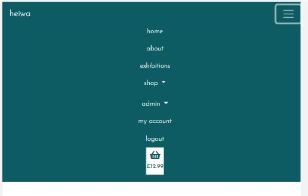
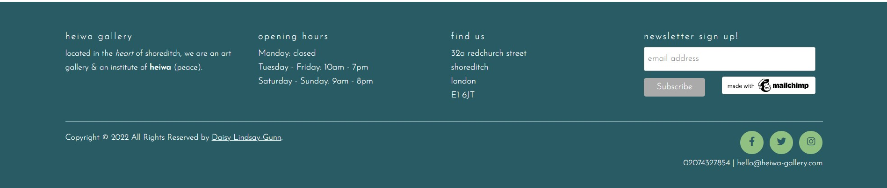
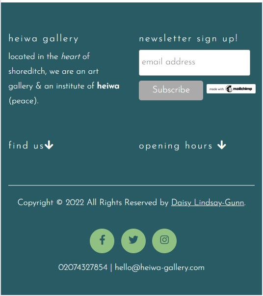
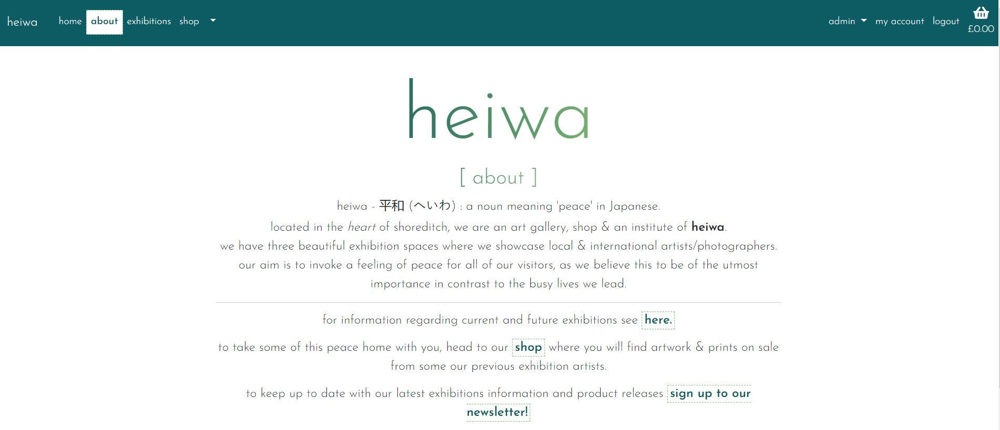
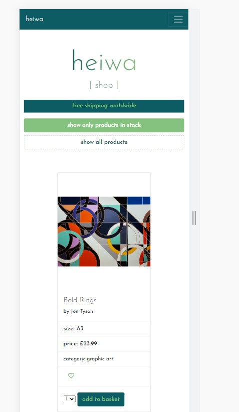
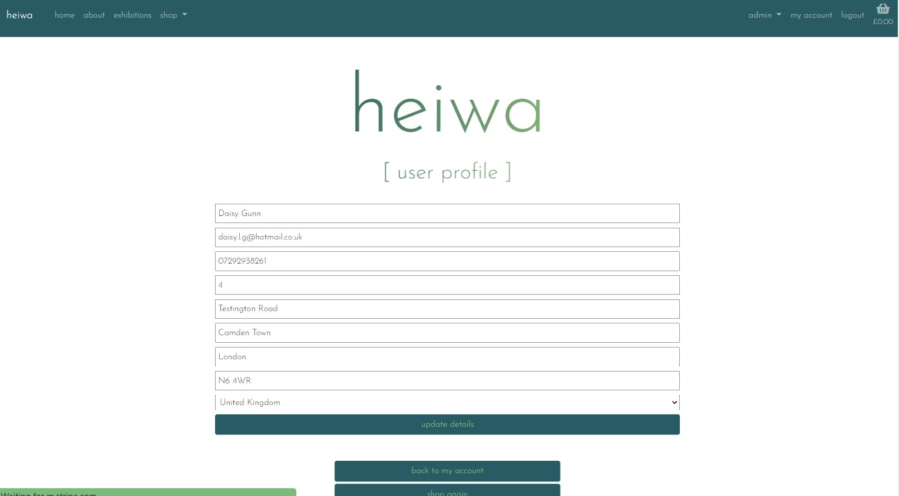
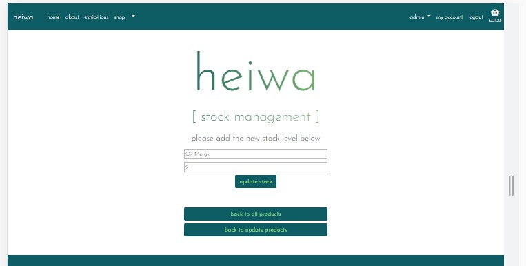

# Heiwa Gallery

[Live application can be found here](https://heiwa-gallery.herokuapp.com/)

This is a full-stack e-commerce projecy built using Django, Python, HTML, CSS and JavaScript. I have created a website for 'Heiwa Gallery' that has been designed to display exhibition information and allows customers to purchase prints of the photography/art from previous exhibition.

## Table of Contents
1. [**UX**](#ux)
    - [**Strategy**](#strategy)
    - [**User stories**](#user-stories)
    - [**Scope**](#scope)
    - [**Structure**](#structure)

2. [**Features**](#features)

4. [**Technologies Used**](#technologies-used)

5. [**Testing**](#testing)

6. [**Deployment**](#deployment)

7. [**Marketing**](#marketing)

8. [**Credits**](#credits)

---
## UX

## Strategy
Using the core UX principles I first started with Strategy, thinking about the target audience for this gallery & the features they would benefit from.

The target audience for 'heiwa' are:
- 25-55 year olds
- Photographers & creatives
- People that enjoy visiting exhibitions, partaking in cultural activities in their spare time

These users will be looking for:
- An informative website, with information that is easy-to-find & concise
- Current & up-to-date exhibitions information, with essential information such as dates & price
- Ability to view & purchase prints that are for sale
- User account functionality to view past orders and store billing information
- A way to sign up to the gallery's newsletter

This website will offer all of these things whilst also allowing for intuitive navigation and comfortability of use. 

Due to the age group of the users, it is assumed that there will be an even split between users viewing the website on their mobiles phone and laptops. Therefore creating something responsive is integral to the design, I have used Bootstrap grids and elements & custom CSS to allow for this.

## User Stories
Please find all my defined user stories & their acceptance criteria [here](https://github.com/daisygunn/heiwa-gallery/issues)

### **Epic 1 - Core Functionality**:

1. As a **user** I can intuitively navigate through the site so that I can view desired content.
2. As a **user** I can find a navigation bar and footer so that I can see what content there is on the website.
2. As a **user** I can get key information about the gallery from the landing page so that I can spend less time having to search for information.
3. As a **user** I am notified about any changes I have made so that I have a clear understanding of what has been completed/updated/failed.
4. As a **user** I can access the website on both mobile and desktop so that I can view the information regardless of my location.

### **Epic 2 - Products**:

5. As a **user** I can view all products that are in stock and available to buy.
6. As a **user** I can easily find all of the relevant information about the products so that I can make informed decisions before purchasing.
7. As a **user** I can filter the prints by categories to have more control over what I'm viewing.
8. As a **user** I can easily identify prints that are not in stock so that I can avoid later frustration if they are not available.

### **Epic 3 - Orders/Basket**:

9. As a **user** I am able to process orders by making a card payment.
10. As a **user** I can view a breakdown of their current basket so that I can make changes if required.
11. As a **user** I can only add prints to my basket that are in stock so that I can avoid later frustration if my order cannot be fulfilled.
12. As a **user** I receive order confirmations to be sure my order has been processed.

### **Epic 4 - Admin Functionality**:

13. As an **admin user** I can log in so that I can access the site's backend.
14. As an **admin user** I am able to login to see the product management page so that I can make changes in the front end.
15. As an **admin user** I can add/edit/remove items from the product model so that I can make sure the website is up to date and accurately reflects what is being sold.
16. As an **admin user** I can update the stock levels for the products so that customers are only able to purchase items in stock.

### **Epic 5 - User Account**:

17. As a **user** I can register & log in so that I can view my orders.
18. As a **user** I can easily see if I'm logged in or not so that I can choose to log in or log out.
19. As a **user** I am prompted to register for an account so that I can create an account and receive the benefits from having a profile.
20. As a **user** I can log in so that I can auto-populate forms with my information on the site.
21. As a **user** I can save my default billing/shipping details so that I can save time making my next purchase.

### **Epic 6 - Exhibition Information**:

23. As an **admin user** I can add/edit/delete exhibition to be displayed on the website.
24. As a **user** I can find the date, description and entry fee for each exhibition so that I can make informed decisions about attending.

### **Epic 7 - Marketing**:

25. As a **user** I can sign up to a newsletter to up to date information regarding exhibitions and items for sale.
26. As an **admin user** I conducted research and implemented SEO keywords to increase traction to my website.
27. As an **admin user** I have created a FB shop page to increase traction to my website.

## Scope

In order to achieve the desired user & business goals, the following features will be included in this release:

- Responsive navbar that will navigate to the various pages throughout the site
- Landing page with image carousel with information to be found on the website
- Shop page, that displays all prints available for purchase with the option to filter on the print category.
- My Account page, for logged in users to update their details which in turn updates the user model. 
- Register/login feature using Django allauth

## Structure

### Databases

<!-- Need to explain each model and the relationship -->
I opted to connect to the Heroku postgres database from the beginning which is provided by Heroku as an add-on.

Almost all of the app's (aside from home) I have created models for, the Entity Relationship Diagram below shows how the database models relate to each other: 

### Skeleton
[Wireframes can be viewed here](assets/documents/heiwa_wireframe.pdf)

Please note the actual website differs slightly from the original wireframes. 

The theme of simplicity follows through to the design, I've used bootstrap columns and rows to divide the pages and tried to keep the same layout throughout so that the user has a sense of ease when on the various pages.

### Surface

I have chosen the name 'heiwa' for the name of the gallery, which is the Japanese word for *'peace'*, this choice of name heavily influences the design choices that I have made. I started by researching which colours in Japanese culture represent peace, which is why I have chosen blues and greens to use as my accent colours and the colour for the main logo/header. The main bulk of the website will incorporate these two colours and feature flecks of black and white. As this is an art gallery the design and feel of the website is minimilastic to reflect the art displayed in the galleries and to continue the theme of peace.

For the font I have chosen 'josefin sans' as I felt it continued with the peaceful theme and I wanted to carry this feeling throughout the entire project; this is also why I have opted to use lowercases throughout.

---
## Features

### Navbar

I have implemented a fixed navbar that remains at the top of the screen at all times, allowing the user to easily navigate through the website. Furthermore, it is responsive and so it collapses in to a burger menu on smaller screens. 

On a laptop it is split in to two sections, on the left the pages relating the gallery and on the right are links to the user profile, basket and for admin users, the admin section. The options displayed vary depending on the user and if they are in fact logged in.

On mobiles the menu is one list displayed in the center.

Active navlinks turn green and bold to clearly indicate to the user which page they are on, further enhancing the usability and ease of the website.

There is also a basket icon with a subtotal displayed below it, to allow the user to keep track of the cost of the products in their basket.

### Footer

The footer has the same colour theme as the navbar & features key information about the gallery. I wanted this information displayed as part of the footer so the user can find it, should they need it, at any point in their customer journey.

I have used JavaScript and JQuery to hide elements of the footer when displayed on a mobile as I felt it was too long and took up too much space. I have also taken advantage of bootstrap column re-ordering, allowing the footer to be as small as possible. 

Also featured is a newsletter sign up form that uses Mailchimp and social media icons to take the user to facebook/twitter/instagram. 

### Home page

The home page, in keeping with the peaceful theme, is very simple. There is a `h1` title followed by a `h2` subtitle with the page name. Below is an animated bootstrap carousel, that provides information and links to the main sections of the website - 'About', 'Exhibitions' & 'Shop'. 

The images used in the carousel are black and white so as not to cause any distraction or major clash with the blues & greens.

### About

The about page provides an insight in to the gallery, their ethos and an explanation of 'heiwa'; there is also a link to the exhibitions page and shop to encourage the user to continue exploring the website and to increase the chance of sales.

### All products

This page displays all of the products sold by the gallery, displayed in a grid of bootstrap cards, each product has an image, product title, photographer or artist name, size & price. Below this there is a select box, with choices of the numbers 1-5 and a button to add the product to the basket. 

Additionally, if a user is logged in then an empty loveheart icon is displayed, once clicked this will add the product to the user's wishlist and the icon becomes solid. If clicked again the product is removed from the wishlist and the heart become empty again.

The products can be filtered by their respective category, this can be done in the navbar and also from the all products page. This filter sends a query to the database and only returns the products that have a category matching the id passed in the url. 

The cards and columns are all responsive so that on a mobile there is the same functionality and the images aren't warped.

### Basket

The basket page provides an overview to all of the items added by the user, the information is displayed in a table that has product name, image, quantity, price and subtotal. The user is able to amend the quantity of each product and also remove it whilst on this page and below there are buttons to proceed to the checkout or to keep shopping.  

If there is nothing in the basket then no table is displayed, and instead a message that says 'your basket is currently empty.'

### Checkout

This page is where the user is able to complete their purchase, split in to two columns, billing & card details on one side and their basket overview on the other. The forms are simple, with placeholders explaining what each input is for.

The card payment feature has been built using , so upon submission of the payment form information is passed to stripe and then back, if successful the user is taken to the 'checkout success' page, that displays the order number and delivery details.

If the payment is not successful, the form does not submit, an error message is displayed and the user is able to recitfy the issues.

### Exhibitions

The exhibitions page displays all exhibition information, they are displayed in a bootstrap card with a title, description, entrance fee and the dates the exhibition showing. There is also a status badge, so it's clear without looking at the dates if it is currently showing or finished.

Similarly to the categories page you can filter by the status so the user is able to only see the exhibitions they want to.

### User profile

A logged in user is able to access the `my account` link, this page displayed links to `personal details`, ` previous orders` and `wishlist`. 

- Personal details is where the user is able to update their default shipping/billing address and contact information.

- Previous order displays a list of all the orders previously made by the user

- Wishlist displays the list of items the user has saved to their wishlist.

### Admin

The admin section of this website allows a logged in superuser to update the exhibitions and product models from the front end, I have broken it down in to exhibtions and product management.

#### **Product management**

Products can be added using the `add product` dropdown, the superuser is taken to a form where upon submission the product is added to the model.

Using the `update products` dropdown the admin user is taken to the update products page, this consists of a datatable that displays all of the product information, including the stock level. In the final column there are action buttons, to edit product info, update stock level or delete entirely. I created a seperate page for this as I felt it was important for product information to be viewed in a different way from the shopping page; the data-table allows the admin user to order the products by any of the column headers giving more control over how the information is viewed.

I chose to keep the stock & product info updating seperate as I didn't want the stock to be able to be edited unintentionally as this could cause problems for the business if the stock level wasn't correct.

#### **Exhibition management**

Products can be added using the `add exhibition` dropdown, the superuser is taken to a form where upon submission the exhibition is added to the model.

Using the `exhibition management` dropdown the admin user is taken to the exhibition management page, this consists of a datatable that displays all of the exhibitions information. In the final column there are action buttons, to edit exhibition info or delete entirely. I created a seperate page for this as I felt it was important for exhibitions information to be viewed in a different way from the exhibition page; the data-table allows the admin user to order the exhibitions by any of the column headers giving more control over how the information is viewed.

---
## Technologies Used

I have used several technologies that have enabled this design to work:

- [Django](https://www.djangoproject.com/)
    - Django is the framework that has been used to build the over project and its apps.
- [Python](https://www.python.org/)
    - Python is the core programming language used to write all of the code in this application to make it fully functional.
- [Bootstrap](https://getbootstrap.com/)
    - Used for creating responsive design.
- [Google Fonts](https://fonts.google.com/)
    - Used to obtain the fonts linked in the header, fonts used were Raleway and Lobster
- [Font Awesome](https://fontawesome.com/)
    - Used to obtain the icons used on the high scores and rules pages.
- [Google Developer Tools](https://developers.google.com/web/tools/chrome-devtools)
    - Used as a primary method of fixing spacing issues, finding bugs, and testing responsiveness across the project.
- [GitHub](https://github.com/)
    - Used to store code for the project after being pushed.
- [Git](https://git-scm.com/)
    - Used for version control by utilising the Gitpod terminal to commit to Git and Push to GitHub.
- [Gitpod](https://www.gitpod.io/)
    - Used as the development environment.
- [Heroku](https://dashboard.heroku.com/apps)
    - Used to deploy my application.
- [Lucid](https://lucid.app/documents#/dashboard)
    - Used to create the ERD for the project.
- [Grammarly](https://www.grammarly.com/)
    - Used to fix the thousands of grammar errors across the project.
- [ImageResizer](https://imageresizer.com/)
    - Used to resize images to reduce loading time.
- [Pep8](http://pep8online.com/)
    - Used to test my code for any issues or errors.
- [Grammarly](https://www.grammarly.com/)
    - Used to fix the grammar errors across the project.
- [Unicorn Revealer](https://chrome.google.com/webstore/detail/unicorn-revealer/lmlkphhdlngaicolpmaakfmhplagoaln?hl=en-GB)
    - Used to detect overflow of elements, which allowed me to quickly debug any issues.
- [Coloors](https://coolors.co/)
    - Used to create a colour palette for the design.
- [Cloudinary](https://cloudinary.com/)
    - Used to store all of my static files and images.
- [Favicon.io](https://favicon.io/)
    - Used to create favicon's for my website
- [Color Contrast Accessibility Validator](https://color.a11y.com/)
    - Allowed me to test the colour contrast of my webpage.
- [W3C Markup Validation Service](https://validator.w3.org/) 
    - Used to validate all HTML code written and used in this webpage.
- [W3C CSS Validation Service](https://jigsaw.w3.org/css-validator/#validate_by_input)
    - Used to validate all CSS code written and used in this webpage.
- [JSHint](https://jshint.com/)
    - Used to validate JS code
- [Freeformatter CSS Beautify](https://www.freeformatter.com/css-beautifier.html)
    - Used to accurately format my CSS code.
- [Freeformatter HTML Formatter](https://www.freeformatter.com/html-formatter.html)
    - Used to accurately format my HTML code.
- [AmIResponsive](http://ami.responsivedesign.is/)
    - Used to generate responsive image used in README file.
- [Wave](https://wave.webaim.org/)
    - Used to test the accessibility of the website.
- [Animate](https://animate.style/)
    - Used to animate main heading and forms. 
- [SQLite](https://www.sqlite.org/index.html)
    - I have SQLite to run my database tests locally.
- [PostgreSQL](https://www.postgresql.org/)
    - I have used Heroku's PostgreSQL relational database in deployment to store the data for my models.
---
## Testing
I have used a combination of manual and automated testing to ensure the website's functionality meets the desired intent.

### Code Validation
All of my code has been validated using an online validator specific to the language, all code now passes with zero errors. 

- [W3C Markup Validation Service](https://validator.w3.org/) 
    - Used to validate all HTML code written and used in this webpage.

- [W3C CSS Validation Service](https://jigsaw.w3.org/css-validator/#validate_by_input)
    - Used to validate all CSS code written and used in this webpage.

- [JSHint](https://jshint.com/)
    - Used to validate JS code

- [Pep8](http://pep8online.com/)
    - Used to test my code for any issues or errors.

In addition to this I have also used online validators to test the accessibility of my website:
- [Wave](https://wave.webaim.org/)
    - Used to test the accessibility of the website.

- [Color Contrast Accessibility Validator](https://color.a11y.com/)
    - Allowed me to test the colour contrast of my webpage.

### Manual Testing

I have tested this project manually myself and have also had it peer-reviewed & tested by friends and family on multiple devices and screen sizes.

[MANUAL TESTING](MANUAL-TESTING.md)

### Automated Testing

[UNIT TESTS](UNIT-TESTING.md)

I have used the Coverage library throughout testing to keep track of how much of my Python code was covered by the tests I had written. From running the coverage report my website has  of my code tested. The remaining code is covered by manual testing.

To generate your own coverage report from the command line:

1. Install the package using `pip3 install coverage`
2. Run `coverage run manage.py test`
3. Then `coverage html` to generate the report
4. You can view the report in a browser by using the command `python3 -m http.server` and opening the `index.html` file from inside the `htmlcov` folder.

### Bugs and Fixes

---
## Deployment

The master branch of this repository has been used for the deployed version of this application.

### Using Github & Gitpod

To deploy my Django application, I had to use the [Code Institute Python Essentials Template](https://github.com/Code-Institute-Org/python-essentials-template).

- Click the `Use This Template` button.
- Add a repository name and brief description.
- Click the `Create Repository from Template` to create your repository.
- To create a Gitpod workspace you then need to click `Gitpod`, this can take a few minutes.
- When you want to work on the project it is best to open the workspace from Gitpod (rather than Github) as this will open your previous workspace rather than creating a new one. You should pin the workspace so that it isn't deleted.
-  Committing your work should be done often and should have clear/explanatory messages, use the following commands to make your commits:
    - `git add .`: adds all modified files to a staging area
    - `git commit -m "A message explaining your commit"`: commits all changes to a local repository.
    - `git push`: pushes all your committed changes to your Github repository.

*Forking the GitHub Repository*

If you want to make changes to your repository without affecting it, you can make a copy of it by 'Forking' it. This ensures your original repository remains unchanged.

1. Find the relevant GitHub repository
2. In the top right corner of the page, click the Fork button (under your account)
3. Your repository has now been 'Forked' and you have a copy to work on

*Cloning the GitHub Repository*

Cloning your repository will allow you to download a local version of the repository to be worked on. Cloning can also be a great way to backup your work.

1. Find the relevant GitHub repository
2. Press the arrow on the Code button
3. Copy the link that is shown in the drop-down
4. Now open Gitpod & select the directory location where you would like the clone created
5. In the terminal type 'git clone' & then paste the link you copied in GitHub
6. Press enter and your local clone will be created.

### Creating an Application with Heroku

I followed the below steps using the Code Institute tutorial and [Django Blog cheatsheat](https://codeinstitute.s3.amazonaws.com/fst/Django%20Blog%20Cheat%20Sheet%20v1.pdf)

- The following command in the Gitpod CLI will create the relevant files needed for Heroku to install your project dependencies `pip3 freeze --local > requirements.txt`. Please note this file should be added to a .gitignore file to prevent the file from being committed. A `Procfile` is also required that specifies the commands that are executed by the app on startup. 

1. Go to [Heroku.com](https://dashboard.heroku.com/apps) and log in; if you do not already have an account then you will need to create one.
2. Click the `New` dropdown and select `Create New App`.
3. Enter a name for your new project, all Heroku apps need to have a unique name, you will be prompted if you need to change it.
4. Select the region you are working in.

*Heroku Settings*
You will need to set your Environment Variables - this is a key step to ensuring your application is deployed properly.
- In the Settings tab, click on `Reveal Config Vars` and set the following variables:
    - SECRET_KEY - to be set to your chosen key
    - CLOUDINARY_URL - to be set to your Cloudinary API environment variable
- In the resources tab you must install 'Heroku Postgres'

*Heroku Deployment*
In the Deploy tab:
1. Connect your Heroku account to your Github Repository following these steps:
    1. Click on the `Deploy` tab and choose `Github-Connect to Github`.
    2. Enter the GitHub repository name and click on `Search`.
    3. Choose the correct repository for your application and click on `Connect`.
2. You can then choose to deploy the project manually or automatically, automatic deployment will generate a new application every time you push a change to Github, whereas manual deployment requires you to push the `Deploy Branch` button whenever you want a change made.
3. Once you have chosen your deployment method and have clicked `Deploy Branch` your application will be built and you should see the below `View` button, click this to open your application:

---

## Marketing

---
## Credits

Throughout the process of building this website, I have used various sources online to help me fix bugs & tackle problems, in addition to various modules to build the functionality of this website:

[Heiwa research](https://japaneseparticlesmaster.xyz/peace-in-japanese/)

[Coverage](https://coverage.readthedocs.io/en/6.2/)

[Crispy Forms](https://django-crispy-forms.readthedocs.io/en/latest/)

[Django Allauth](https://django-allauth.readthedocs.io/en/latest/installation.html)

[Gmail SMTP](https://medium.com/@_christopher/how-to-send-emails-with-python-django-through-google-smtp-server-for-free-22ea6ea0fb8e)

[Testing](https://www.youtube.com/watch?v=0MrgsYswT1c)

[Unsplash for images](https://unsplash.com/@daisygunn94/likes)

[Date calculations](https://stackoverflow.com/questions/3642892/calculating-if-date-is-in-start-future-or-present-in-python)

[DataTables](https://datatables.net/)

[XML sitemaps](https://www.xml-sitemaps.com/)

---
## Acknowledgements

I would like to thank my course mentor Guido Cecilio for his support and guidance throughout the course of the project and my peers Harry Dhillon and Jack Crosbie for their support & feedback.

---